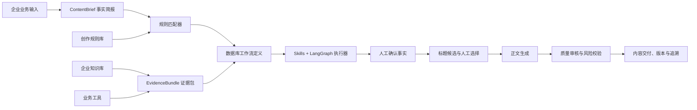

<div align="center">
  <h1>contentSwarm</h1>

  <p><strong>面向中小微企业的 AI 内容生产平台</strong></p>
  <p>把创作方法、企业事实、知识资产与生成模型组合成可配置、可执行、可审核、可追溯的内容生产流程。</p>

  [](web/)
  [](backend/)
  [](backend/package/yuxi/agents/buildin/content_workflow/)
  [](docker-compose.yml)
  [](LICENSE)
</div>

## 项目简介

contentSwarm 不是一个依赖“大 Prompt”临时发挥的文案生成器，而是一套企业级内容生产工作台。平台先把业务资料整理为统一事实简报和证据包，再依据结构化创作规则选择创作策略，最后由确定性工作流协调 Skills、知识库、业务工具和生成模型完成标题、正文、审核与保存。

它适合餐饮与本地生活、教育培训、美业与个人护理、零售与电商、专业服务、装修与家居等中小微企业，也可以通过行业模板、规则版本和数据库工作流扩展到更多业务场景。

## 核心能力

### 四阶段内容工作台

1. **业务素材**：选择行业、内容目标和输入模式，录入品牌、产品、用户痛点、优势、数据与业务场景。
2. **创作策略**：自动匹配创作手法、标题公式和正文公式，同时给出缺失变量与不兼容提示。
3. **内容生成**：汇总企业资料与知识库证据，生成标题候选，人工选定标题后继续生成正文。
4. **审核交付**：检查事实、数字、风险表达和内容结构，支持编辑、审核、定稿与版本保存。

### 结构化创作规则库

- 4 种核心创作手法：数字法、悬念法、价值法、人群定位法
- 1 种场景增强方法：人物、时间、地点、冲突与变化
- 7 类标题公式
- 4 类正文公式
- 4 类内容目标：流量曝光、干货教育、获客转化、品牌人设
- 组合规则、优先级、变量校验、自动推荐和不兼容拦截
- 规则版本发布、回滚和运行时版本锁定

### 企业知识与事实证据

- 支持 Milvus 向量知识库，以及 Dify、Notion 只读知识源
- 企业产品、案例、服务、价格与业务资料统一沉淀
- 先生成 `ContentBrief` 与 `EvidenceBundle`，标题和正文同源使用
- 数字、效果、价格和承诺类表达要求有来源或人工确认
- 保存知识引用、来源标识、规则版本、模型信息与人工修改记录

### 可控工作流

- 工作流定义存储在 PostgreSQL，由通用 LangGraph 执行器解释运行
- Skill 负责“怎么创作”，Tool 负责“取什么数据”
- 支持事实确认、标题选择等人工暂停节点
- 支持暂停恢复、失败重试、取消执行和节点状态追踪
- 结果支持质量审核、版本历史、生产历史与来源追溯

### 双输入模式与行业模板

- **简化版**：面向移动端和一线业务人员，以少量关键输入快速生成
- **专业版**：补充目标人群、价格周期、人设语气、典型场景、必含词、禁用词和知识库范围
- 首批内置 6 个行业模板，可继续增加行业字段、默认策略与审核规则

## 工作原理



默认内容工作流由以下节点组成：

```text
编译事实简报
  → 规划创作策略
  → 收集证据
  → 人工确认关键事实（按需）
  → 生成标题候选
  → 人工选择标题
  → 生成正文
  → 确定性校验
  → AI 质量审核
  → 保存内容与版本
```

## 技术架构

| 层级 | 技术与职责 |
| --- | --- |
| Web 工作台 | Vue 3、Vite、Pinia、Ant Design Vue |
| API 服务 | FastAPI、SQLAlchemy、Pydantic |
| 工作流 | LangGraph、数据库工作流定义、人工中断与恢复 |
| 异步执行 | ARQ Worker、Redis 队列与事件流 |
| 规则与业务数据 | PostgreSQL |
| 知识检索 | Milvus、Neo4j、企业 RAG |
| 文件与产物 | MinIO、用户工作区、沙盒 |
| 模型与扩展 | 模型供应商、Skills、Tools、MCP |
| 部署 | Docker Compose、Nginx |

## 快速开始

### 环境要求

- Docker Engine 24+ 与 Docker Compose v2
- 至少 4 GB 内存，推荐 8 GB 或以上
- 至少 20 GB 可用磁盘空间
- 一个可用的对话模型和 Embedding 模型 API Key

### 1. 克隆项目

```bash
git clone https://github.com/shenwei8899-ctrl/contentSwarm.git
cd contentSwarm
```

### 2. 初始化环境变量

```bash
cp .env.template .env
```

至少配置以下内容：

```dotenv
SILICONFLOW_API_KEY=your_api_key
JWT_SECRET_KEY=your_random_secret
YUXI_INSTANCE_ID=content-swarm-local
LITE_MODE=false
```

`JWT_SECRET_KEY` 建议使用随机强值：

```bash
openssl rand -hex 32
```

也可以运行交互式初始化脚本，它会帮助生成安全配置并拉取依赖镜像：

```bash
./scripts/init.sh
```

### 3. 启动完整服务

```bash
docker compose up -d --build
```

查看启动状态：

```bash
docker compose ps
docker compose logs -f api worker
```

### 4. 打开工作台

浏览器访问 [http://localhost:5173](http://localhost:5173)。首次启动时，系统会引导创建超级管理员。

登录后常用入口：

- `/content/new`：新建内容任务
- `/content/history`：生产历史
- `/content/admin/rules`：创作规则库
- `/knowledge`：企业知识库
- `/model-manage`：模型配置

## 知识库配置

完整的内容生产链路建议保持：

```dotenv
LITE_MODE=false
```

完整模式会启用 PostgreSQL、Redis、MinIO、Milvus 与 Neo4j，并挂载 `/api/knowledge/*` 知识库接口。创建 Milvus 知识库前，请先在模型管理中确认至少有一个可用的 Embedding 模型。

`LITE_MODE=true` 只适合不使用企业知识库和图谱能力的轻量开发场景；该模式会关闭知识库、知识评估和图谱路由，不能用于需要 RAG 证据的正式内容生产。

## 生产部署

准备独立的 `.env.prod`，不要把生产密码提交到 Git。至少应设置：

```dotenv
YUXI_ENV=production
LITE_MODE=false
JWT_SECRET_KEY=replace_with_random_secret
YUXI_INSTANCE_ID=replace_with_unique_instance_id
POSTGRES_USER=postgres
POSTGRES_PASSWORD=replace_with_strong_password
POSTGRES_DB=content_swarm
NEO4J_USERNAME=neo4j
NEO4J_PASSWORD=replace_with_strong_password
MINIO_ACCESS_KEY=replace_with_access_key
MINIO_SECRET_KEY=replace_with_strong_secret
SILICONFLOW_API_KEY=your_api_key
```

启动生产环境：

```bash
docker compose --env-file .env.prod -f docker-compose.prod.yml up -d --build
```

默认生产访问地址为 `http://服务器地址:8088`。正式上线建议在前面增加 HTTPS 反向代理，并确保 PostgreSQL、Redis、Milvus、MinIO 和 Neo4j 不直接暴露到公网。

## 项目目录

```text
contentSwarm/
├── apps/hycanvas/                              # 内置视觉创作、模板与画布编辑模块
├── backend/
│   ├── package/yuxi/content/                  # 内容规则、生成、校验与数据结构
│   ├── package/yuxi/agents/buildin/content_workflow/
│   │                                          # 数据库驱动的 LangGraph 内容工作流
│   ├── package/yuxi/agents/skills/buildin/    # 内容策略、标题、正文和审核 Skills
│   ├── package/yuxi/services/                 # 内容服务与异步 Worker
│   ├── package/yuxi/storage/postgres/         # 规则、任务、版本和追溯模型
│   ├── server/routers/content_router.py       # 内容生产 API
│   └── test/                                  # 单元与集成测试
├── web/
│   ├── src/views/ContentStudioView.vue        # 四阶段内容工作台
│   ├── src/views/ContentHistoryView.vue       # 生产历史
│   ├── src/views/ContentRuleLibraryView.vue   # 创作规则库
│   └── src/stores/contentStudio.js            # 内容工作台状态管理
├── docker/                                    # 服务镜像与运行依赖
├── docker-compose.yml                         # 本地开发环境
└── docker-compose.prod.yml                    # 生产环境
```

## 开发与验证

前端：

```bash
cd web
pnpm install
pnpm build
pnpm lint
```

视觉创作模块：

```bash
cd apps/hycanvas
npm install
npm run lint -w frontend
npm run build:packages
HYCANVAS_AUTH_MODE=contentswarm CONTENTSWARM_URL=http://127.0.0.1:5173 BUILD_DIST=true npm run build:dist -w frontend
```

后端测试：

```bash
cd backend
uv sync
uv run pytest test/unit/content -q
uv run pytest test/integration/api/test_content_router.py -q
```

服务健康检查：

```bash
curl http://localhost:5050/api/system/health
```

## 产品原则

1. **方法结构化**：创作方法不只存在于一个大 Prompt 中。
2. **事实先于文案**：先形成事实简报与证据包，再生成标题和正文。
3. **规则和知识分离**：精确规则进入 PostgreSQL，行业知识与案例进入 RAG。
4. **工作流可配置**：流程定义存数据库，由通用执行器解释运行。
5. **Skill 和 Tool 分工**：Skill 决定怎么做，Tool 决定取什么数据。
6. **同源生成**：标题、正文和话题使用同一份事实与证据。
7. **关键事实可确认**：价格、效果、承诺与高风险表达支持人工暂停确认。
8. **全过程可追溯**：保存规则、知识、模型、人工修改与审核记录。

## 开发状态

当前版本为 MVP，已经覆盖内容创建、规则匹配、知识证据、人工节点、生成审核、版本保存与失败恢复等核心链路。下一阶段可继续扩展可视化工作流编辑器、更多行业模板、渠道适配、团队协作、内容排期与效果数据回流。

## License

本项目采用 [MIT License](LICENSE)。
